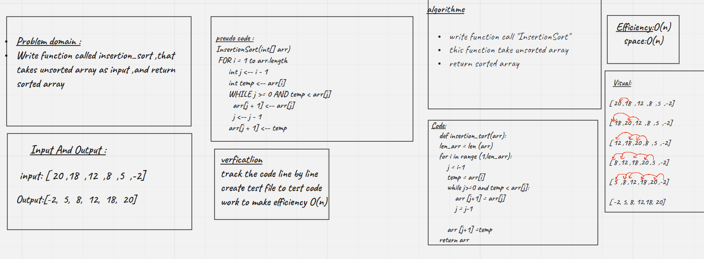

# Challenge Summary
<!-- Description of the challenge -->
Write function called insertion_sort ,that takes unsorted array as input ,and return sorted array
## Whiteboard Process
<!-- Embedded whiteboard image -->

## Approach & Efficiency
<!-- What approach did you take? Why? What is the Big O space/time for this approach? -->
Efficiency:O(n)
space:O(n)

## Solution
<!-- Show how to run your code, and examples of it in action -->
- write functin to sort value used Pseudocode givin

[pull_request]()
