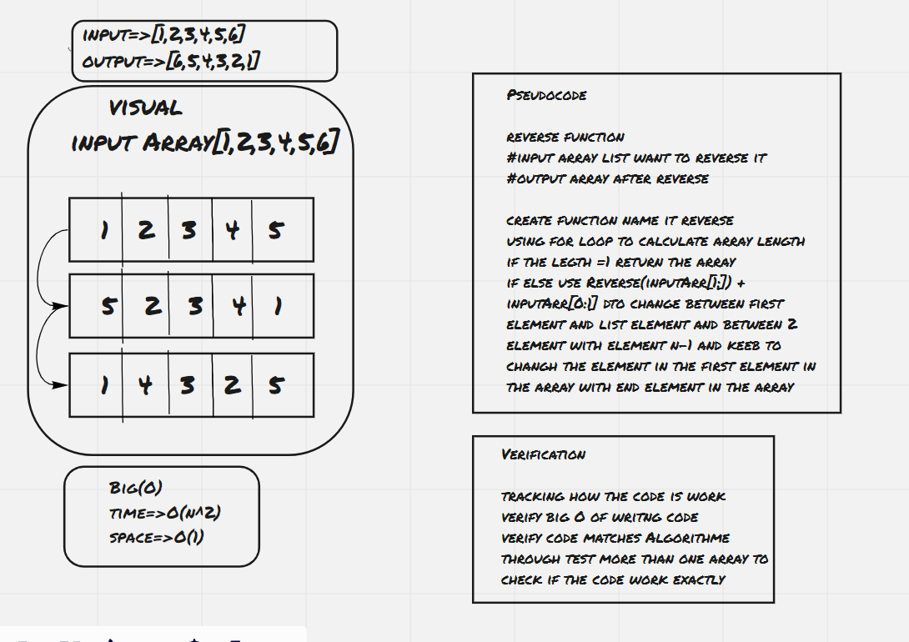

# Reverse an Array
Create a function called reverseArray,this function takes an array as an argument. Without utilizing any of the built-in methods available to your language, return an array with elements in reversed order.

the output of the array it should be the reserve of input array for example:
[1, 2, 3, 4, 5, 6]    output=>[6, 5, 4, 3, 2, 1]

## Whiteboard Process

## Approach & Efficiency
time=>O(n^2)
<!-- What approach did you take? Discuss Why. What is the Big O space/time for this approach? -->

it take me 4 hour to complet the work
