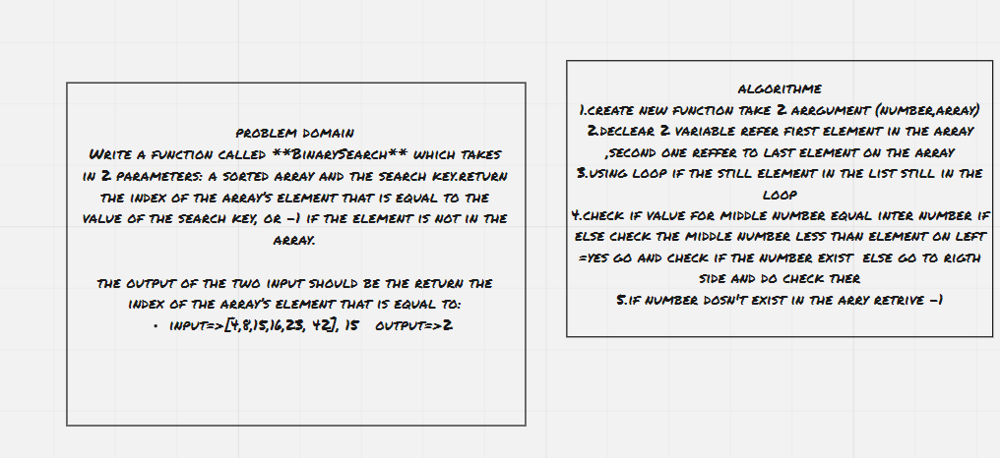
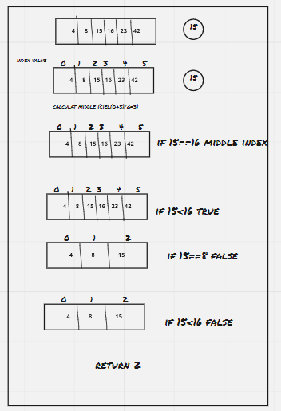

# array binary search
Write a function called **BinarySearch** which takes in 2 parameters: a sorted array and the search key.return the index of the array’s element that is equal to the value of the search key, or -1 if the element is not in the array.

the output of the two input should be the return the index of the array’s element that is equal to:
input=>[4,8,15,16,23, 42], 15	output=>2

## Whiteboard Process

## Approach & Efficiency
time=>O(n)
where i use one loop

[Here](https://github.com/monaSalih/data-structures-and-algorithms/tree/array-binary-search) you can found alink for pull request for this code chalinge
<!-- What approach did you take? Discuss Why. What is the Big O space/time for this approach? -->
