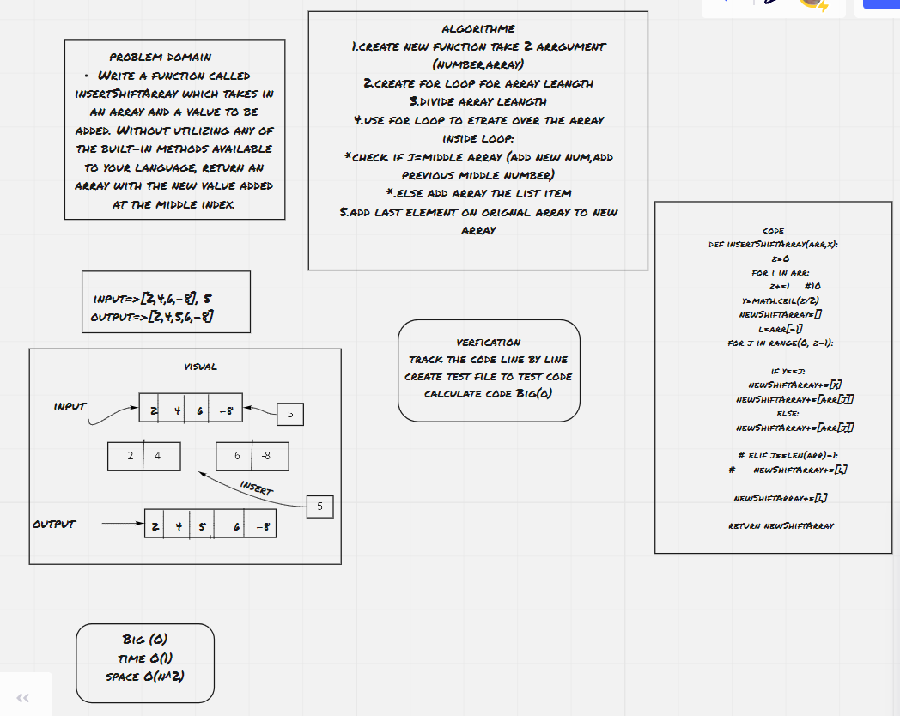

# Array Insert Shift
write python code for function take two argument (int number,array) the output should be assign new number to middle of the array without

the output of the array it should be the reserve of input array for example:
[1, 2, 3, 4, 5, 6]    output=>[6, 5, 4, 3, 2, 1]

## Whiteboard Process

## Approach & Efficiency
time=>O(n^2)
<!-- #################################### -->
[Here](https://github.com/monaSalih/data-structures-and-algorithms/tree/array-insert-shift) you can found alink for pull request for this code chalinge
<!-- What approach did you take? Discuss Why. What is the Big O space/time for this approach? -->

# time to complet solve 
it take 4 hour
