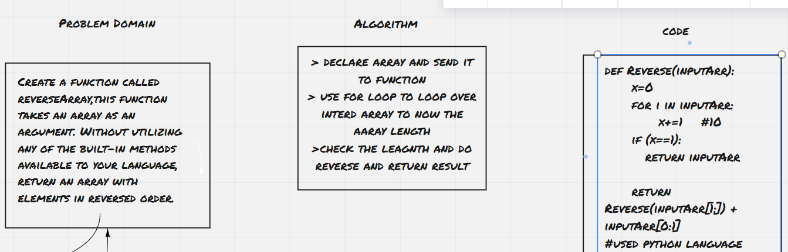
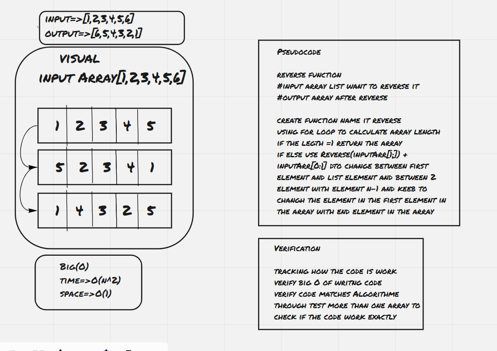

# Reverse an Array
Create a function called reverseArray,this function takes an array as an argument. Without utilizing any of the built-in methods available to your language, return an array with elements in without order list, and most important thing didn't use any of the built-in methods.

the output of the two input should be the insert new number in the middle of the list:
input=>[2,4,6,-8], 5	output=>[2,4,5,6,-8]

## Whiteboard Process

## Approach & Efficiency
time=>O(n^2)

[Here](https://github.com/monaSalih/data-structures-and-algorithms/pull/19) you can found alink for pull request for this code chalinge
<!-- What approach did you take? Discuss Why. What is the Big O space/time for this approach? -->
