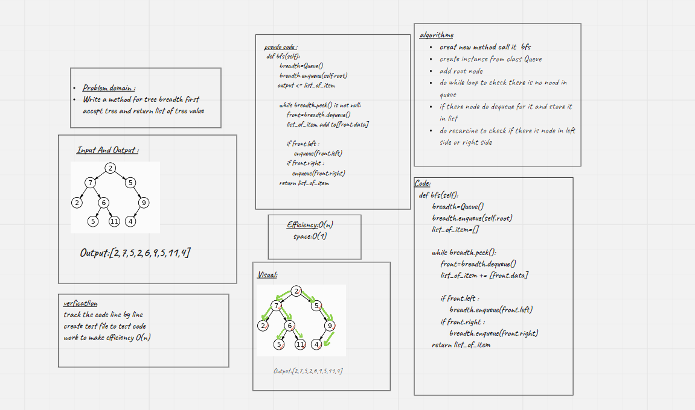

# Challenge Summary

[bfs_pull_request](https://github.com/monaSalih/data-structures-and-algorithms/pull/32)
<!-- Description of the challenge -->

### Breadth first search for tree

Write a function called breadth first ,the input tree, this function return list of all values in the tree, in the order they were encountered

## Whiteboard Process
<!-- Embedded whiteboard image -->

## Approach & Efficiency
<!-- What approach did you take? Why? What is the Big O space/time for this approach? -->
Efficiency:O(n)
space:O(1)
## Solution
<!-- Show how to run your code, and examples of it in action -->

-[x] creat new method call it  bfs

-[x]  create instanse from class Queue

-[x] add root node

-[x] do while loop to check there is no nood in queue

-[x] if there node do dequeue for it and store it in list

-[x] do recarcine to check if there is node in left side or right side

