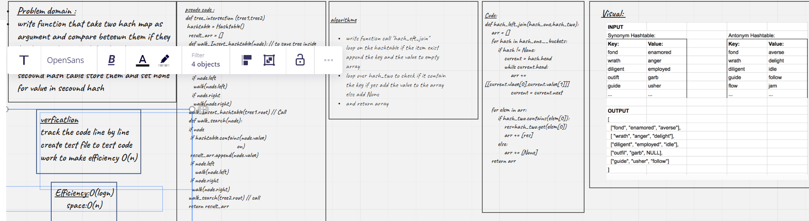

# Hashmap LEFT JOIN
<!-- Short summary or background information -->
write function that take two hash map as argument and compare beteewn them if they key have value in both hash table store them in array if the key didnt have in the secound hash table store them and set none for value in secound hash
## Challenge
<!-- Description of the challenge -->

## Approach & Efficiency
<!-- What approach did you take? Why? What is the Big O space/time for this approach? -->
Efficiency:O(logn)
space:O(n)
## Solution
<!-- Embedded whiteboard image -->
```
def hash_left_join(hash_one,hash_two):
    arr = []
    for hash in hash_one.__buckets:
        if hash != None:
            current = hash.head
            while current.head:
                arr += [[current.vlaue[0],current.value[1]]]
                current = current.next

    for elem in arr:
        if hash_two.contains(elem[0]):
            res=hash_two.get(elem[0])
            arr += [res]
        else:
            arr += [None]
    return arr

```
