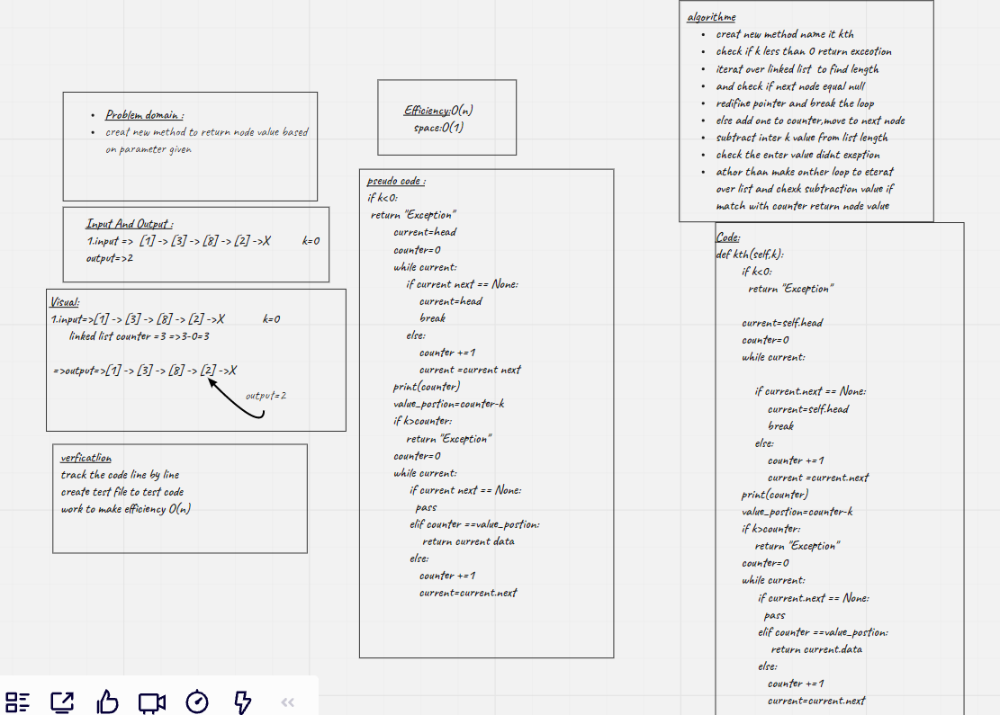

# Challenge Summary
<!-- Description of the challenge -->
Creat new method kth take number(k) as a parameters,return the node value that is k places from the tail of linked list.

## Whiteboard Process
<!-- Embedded whiteboard image -->

## Approach & Efficiency
<!-- What approach did you take? Why? What is the Big O space/time for this approach? -->
Efficiency:O(n)
Space time:O(1)

# Do list:
[x]Where k is greater than the length of the linked list

[x]Where k and the length of the list are the same

[x]Where k is not a positive integer

[x]Where the linked list is of a size 1

[x]“Happy Path” where k is not at the end, but somewhere in the middle of the linked list
