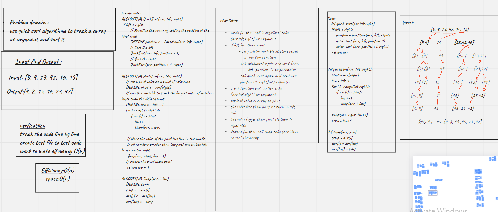

# Challenge Summary
<!-- Description of the challenge -->
write function take function to sort unsort array using quick sort
## Whiteboard Process
<!-- Embedded whiteboard image -->

## Approach & Efficiency
<!-- What approach did you take? Why? What is the Big O space/time for this approach? -->
Efficiency:O(n)
space:O(n)
## Solution
<!-- Show how to run your code, and examples of it in action -->
```
def quick_sort(arr,left,right):
    if left < right:
        position = partition(arr, left, right)
        quick_sort (arr, left, position-1)
        quick_sort (arr, position+1, right)
    return arr


def partition(arr, left ,right):
    pivot = arr[right]
    low = left-1
    for i in range(left,right):
        if arr[i]<= pivot:
            low +=1
            swap(arr, i, low)

    swap(arr, right, low+1)
    return low+1

def swap(arr,i,low):
    temp = arr[i]
    arr[i] = arr[low]
    arr[low] = temp
```
[pull_request](https://github.com/monaSalih/data-structures-and-algorithms/pull/37)
