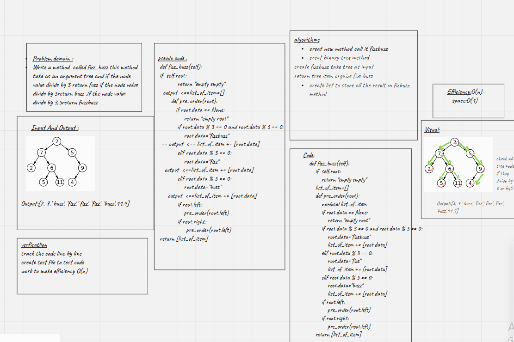

# Challenge Summary
<!-- Description of the challenge -->
in this lab we have to check all tree contant if they are fizz or buzz

Tree-Fizz-Buzz
## Whiteboard Process
<!-- Embedded whiteboard image -->

## Approach & Efficiency
<!-- What approach did you take? Why? What is the Big O space/time for this approach? -->
Efficiency:O(n)
space:O(n)
## Solution
<!-- Show how to run your code, and examples of it in action -->
creat new method call it fizzbuzz
creat binary tree method
create fizzbuzz take tree as input
return tree item orgnize fizz buzz
create list to store all the result in fizbuzz method

[Pull_request](https://github.com/monaSalih/data-structures-and-algorithms/pull/33)

