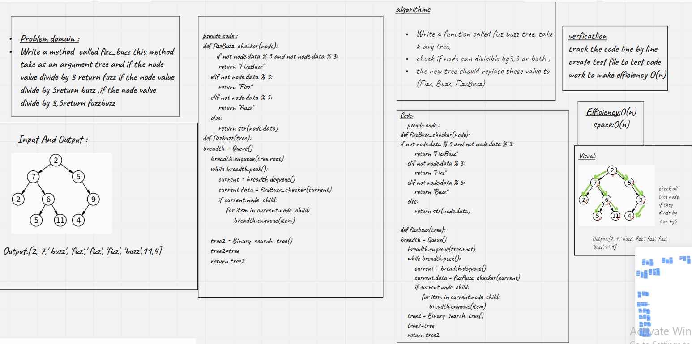

# Challenge Summary
<!-- Description of the challenge -->
Tree-Fizz-Buzz:
Write a function called fizz buzz tree, take k-ary tree,
check if node can divisible by3,5 or both , the new tree should replace these value to (Fizz, Buzz, FizzBuzz)

## Whiteboard Process
<!-- Embedded whiteboard image -->

## Approach & Efficiency
<!-- What approach did you take? Why? What is the Big O space/time for this approach? -->

## Solution
<!-- Show how to run your code, and examples of it in action -->
i used recursive approch that eterate over tree node ,check if they fizz or buzz or both and return new tree with new value (Fizz, Buzz, FizzBuzz)
