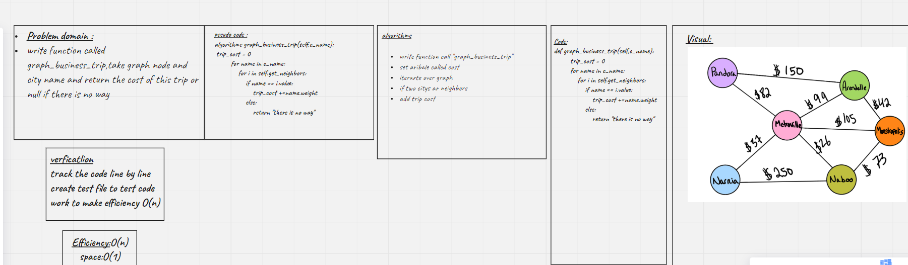

# Depth First Traversal
<!-- Short summary or background information -->
implement a breadth-first traversal on graph
## Challenge
<!-- Description of the challenge -->
write function name Depth first take an node as argumment,and return collection of nodes in pre-order depth-first traversal order
## Approach & Efficiency
<!-- What approach did you take? Why? What is the Big O space/time for this approach? -->
time:
space:

## Solution
<!-- Embedded whiteboard image -->
```
def graph_depth_first(self,vertex):
         depth=[]
         depth_list=[]
         depth_list.append(vertex)
         while (len(depth_list)):
             edges=self.get_neighbors(vertex)
             if len(edges):
                 for i in edges:
                     if not i.vertex in depth_list:
                         depth_list.append(i.vertex)
         return depth
```


