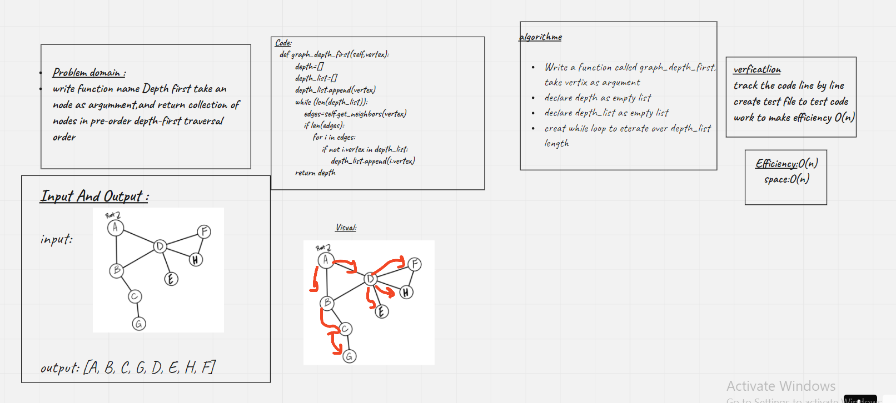

# Graphs
<!-- Short summary or background information -->
write function called graph_business_trip,take graph node and city name and return the cost of this trip or null if there is no way
## Challenge
<!-- Description of the challenge -->
* graph_business_trip
Arguments: graph node and city name
Returns:  the cost of this trip or null if there is no way




## Approach & Efficiency
<!-- What approach did you take? Why? What is the Big O space/time for this approach? -->
time:O(n)
space:O(n)

## API
<!-- Description of each method publicly available in your Graph -->
```
def graph_business_trip(self,c_name):
         trip_cost = 0
         for name in c_name:
             for i in self.get_neighbors:
                 if name == i.value:
                     trip_cost +=name.weight
                 else:
                     return "there is no way"
```
