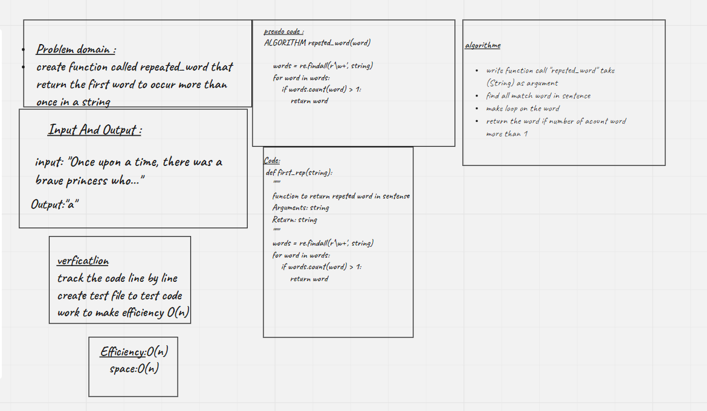

# Hashtables
<!-- Short summary or background information -->
A hash table is a data structure that is used to store keys/value pairs.

## Challenge
<!-- Description of the challenge -->
implement following methode (add,contains,get,hash) in hash table class
## Approach & Efficiency
<!-- What approach did you take? Why? What is the Big O space/time for this approach? -->

* repeated_word:
      - time : O(n)
      - space: O(1)

## API
<!-- Description of each method publicly available in each of your hashtable -->
* repeated_word:
function to return repeted word in sentense take string as argument and return string

[pull_request](https://github.com/monaSalih/data-structures-and-algorithms/pull/39)
