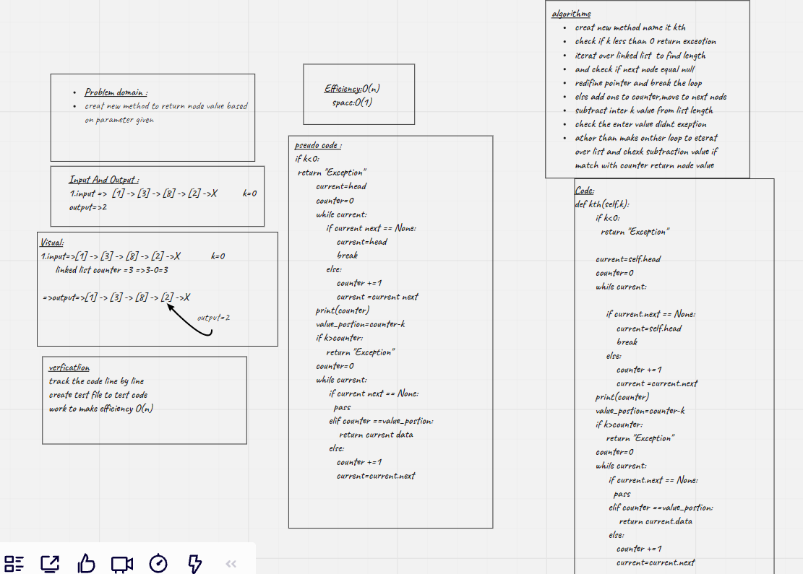

# Singly Linked List
<!-- Short summary or background information -->
Linked List

A linked list is a linear data structure, in which the elements are not stored at contiguous memory locations.


## Challenge
<!-- Description of the challenge -->
creat class name it Node stored value and pointer for next node.
creat Linked List class where include  head property.
Upon instantiation, an empty Linked List should be created.

creat method name it insert take 1value and add it to the empty list

creat method name it includes take 1value and if this value exist in the linked list and return Boolean

creat method name it toString take "none" and return formated list like foolowing:
"""
{ a } -> { b } -> { c } -> NULL"
"""

## Approach & Efficiency
<!-- What approach did you take? Why? What is the Big O space/time for this approach? -->
in my case it will take o(n)


## API
<!-- Description of each method publicly available to your Linked List -->
Methods

* insert
```
input=>Arguments: value
output=>Returns: nothing
Description=>Adds a new node with that value to the head of the list with an O(1) Time performance.
```
* includes
```
input=>Arguments: value
output=>Returns: Boolean
Description=>Indicates whether that value exists as a Node’s value somewhere within the list.
```
* to string
```
input=>Arguments: none

output=>Returns: a string representing all the values in the Linked List, formatted as:

"{ a } -> { b } -> { c } -> NULL"
```


[click_here](https://github.com/monaSalih/data-structures-and-algorithms/tree/linked-list/python/code_challenges/linked_list)to go to the linked list


<!-- /dkciosdjfijfoijfosijerfrjiosrj -->

_____________________________________________
# Kth linked list
# Challenge Summary
<!-- Description of the challenge -->
Creat new method kth take number(k) as a parameters,return the node value that is k places from the tail of linked list.


## Whiteboard Process
<!-- Embedded whiteboard image -->

## Approach & Efficiency
<!-- What approach did you take? Why? What is the Big O space/time for this approach? -->
Efficiency:O(n)
Space time:O(1)

# Do list:
[x]Where k is greater than the length of the linked list

[x]Where k and the length of the list are the same

[x]Where k is not a positive integer

[x]Where the linked list is of a size 1

[x]“Happy Path” where k is not at the end, but somewhere in the middle of the linked list


<!-- #Url link
* [linked-list-kth.py-link](https://github.com/monaSalih/data-structures-and-algorithms/blob/linked-list-kth/python/code_challenges/linked_list/linked_list.py)

* [branch-url](https://github.com/monaSalih/data-structures-and-algorithms/tree/linked-list-kth/python/code_challenges/linked_list) -->

