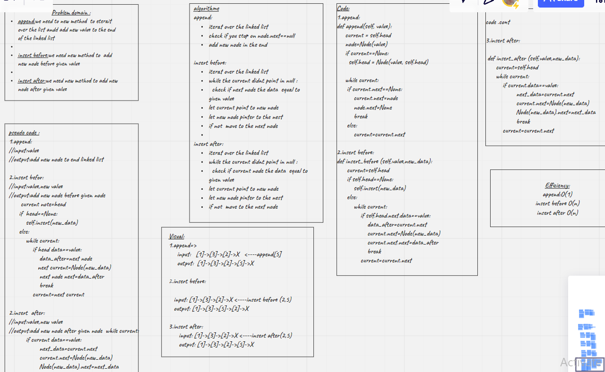

# Singly Linked List
<!-- Short summary or background information -->
Linked List

A linked list is a linear data structure, in which the elements are not stored at contiguous memory locations.


## Challenge
<!-- Description of the challenge -->
creat class name it Node stored value and pointer for next node.
creat Linked List class where include  head property.
Upon instantiation, an empty Linked List should be created.

creat method name it insert take 1value and add it to the empty list

creat method name it includes take 1value and if this value exist in the linked list and return Boolean

creat method name it toString take "none" and return formated list like foolowing:
"""
{ a } -> { b } -> { c } -> NULL"
"""

## Approach & Efficiency
<!-- What approach did you take? Why? What is the Big O space/time for this approach? -->
in my case it will take o(n)


## API
<!-- Description of each method publicly available to your Linked List -->
Methods

* insert
```
input=>Arguments: value
output=>Returns: nothing
Description=>Adds a new node with that value to the head of the list with an O(1) Time performance.
```
* includes
```
input=>Arguments: value
output=>Returns: Boolean
Description=>Indicates whether that value exists as a Node’s value somewhere within the list.
```
* to string
```
input=>Arguments: none

output=>Returns: a string representing all the values in the Linked List, formatted as:

"{ a } -> { b } -> { c } -> NULL"
```


[click_here](https://github.com/monaSalih/data-structures-and-algorithms/pull/23)to go to the linked list pull request

## challange06
## whiteBoard


### Methods

* append
```
arguments: new value
this method do the following:
>adds a new node with the given value to the end of the list
>add multiple nodes to the end of a linked list
```
Approach & Efficiency
efficiency o(n)
space o(1)

* insert before
```
arguments: value, new value
this method do the following:
> Before the middle list add new node
> Before the the head
```
Approach & Efficiency
efficiency o(n)
space o(1)

* insert after
arguments: value, new value
this method do the following:
>adds a new node  after a node in the middle
>insert a node after the last node of the linked list

## Approach & Efficiency
efficiency o(n)
space o(1)


[click_here](https://github.com/monaSalih/data-structures-and-algorithms/pull/24)to go to the linked list pull request

## test feature
[X]Can successfully add a node to the end of the linked list

[X]Can successfully add multiple nodes to the end of a linked list

[X]Can successfully insert a node before a node located i the middle of a linked list

[X]Can successfully insert a node before the first node of a linked list

[X]Can successfully insert after a node in the middle of the linked list

[X]Can successfully insert a node after the last node of the linked list
