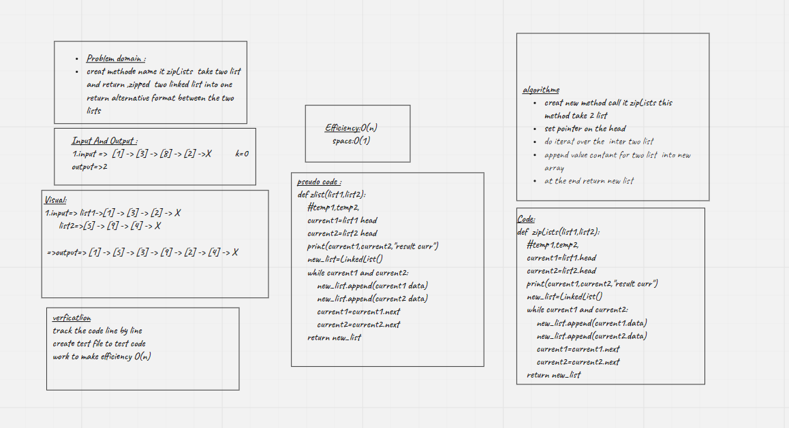

# Challenge Summary
<!-- Description of the challenge -->
Creat Zip_list function this function take 2 linked list and return zipped list where node return alternative list between the two list and reference to the head of new list

## Whiteboard Process
<!-- Embedded whiteboard image -->

## Approach & Efficiency
<!-- What approach did you take? Why? What is the Big O space/time for this approach? -->
in this code challange create new method accept two list in order to zipped them in one list ,following space and time efficiency
efficiency=>O(n)
space=>O(n)
## Solution
<!-- Show how to run your code, and examples of it in action -->

i used python poetry shell to navigat the test also use python note bad test to test the real result

## feature test
[x]Write a function called zip lists

[x]Arguments: 2 linked lists

[x]Return: Linked List, Zip the two linked lists together into one so that the nodes alternate between the two lists and return a reference to the head of the zipped list.

[x]Try and keep additional space down to O(1)

[x]You have access to the Node class and all the properties on the Linked List class as well as the methods created in previous challenges

* [pull_request](https://github.com/monaSalih/data-structures-and-algorithms/pull/28)

