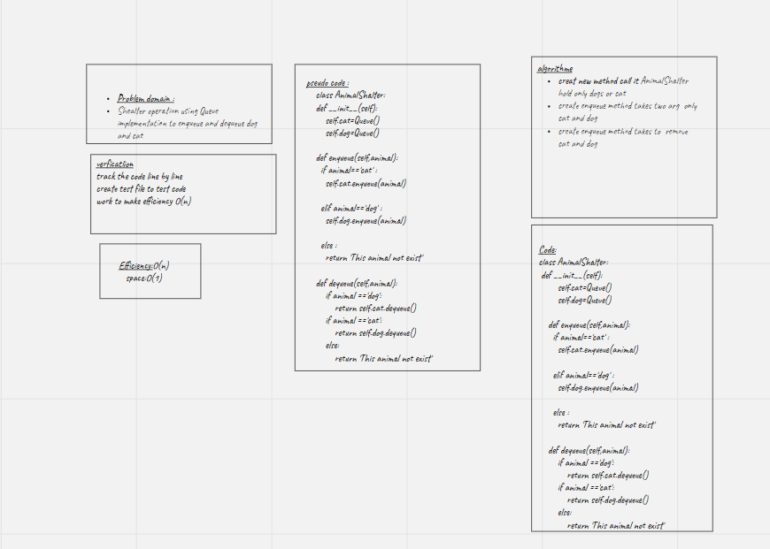

# stack-queue-animal-shelter

# Challenge Summary
Shealter operation using Queue implementation to enqueue and dequeue dog and cat

## Whiteboard Process
<!-- Embedded whiteboard image -->

## Approach & Efficiency
<!-- What approach did you take? Why? What is the Big O space/time for this approach? -->

## Solution
<!-- Show how to run your code, and examples of it in action -->
Create class name animal Shelter contane two method  enqueue and dequeue, in enqueue can add animal either a dog or a cat object.
dequeue use pref dog or cat and return dog or cat based on preference

[pull_request_link]()
