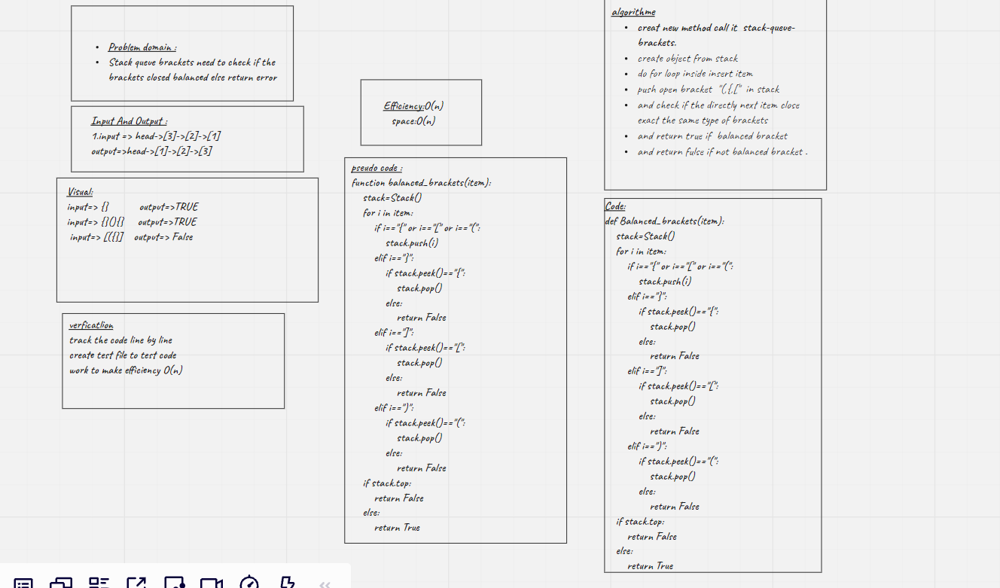

# Challenge Summary
<!-- Description of the challenge -->
Stack queue brackets need to check if the brackets closed balanced else return error
## Whiteboard Process
<!-- Embedded whiteboard image -->

## Approach & Efficiency
<!-- What approach did you take? Why? What is the Big O space/time for this approach? -->
efficiency=>O(n)
space=O(n)
## Solution
<!-- Show how to run your code, and examples of it in action -->

use stack to store one of open brackets => "(,{,[" and push to the stack, and check if insert close bracket =>"),},]" store in variabul and check if the close brackets match with open bracket on the top stack if match balanced bracket then pop out the top element and return true else return false

[pull](https://github.com/monaSalih/data-structures-and-algorithms/pull/29) liked list 
