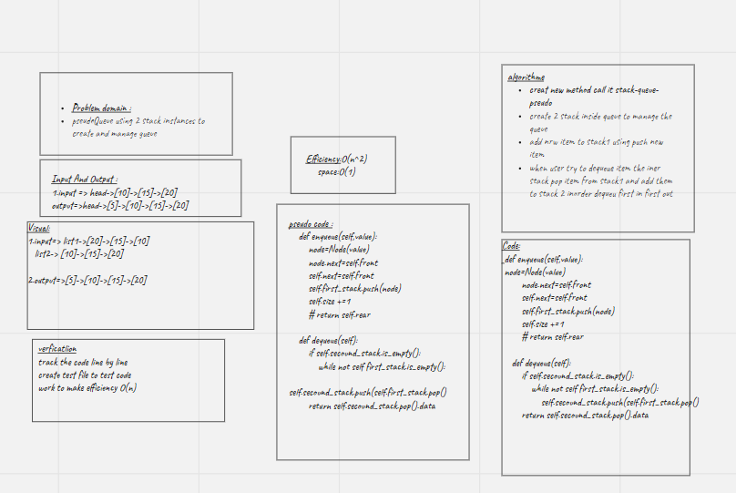

# Challenge Summary
<!-- Description of the challenge -->
Use two stack to implement queue
## Whiteboard Process
<!-- Embedded whiteboard image -->

## Approach & Efficiency
<!-- What approach did you take? Why? What is the Big O space/time for this approach? -->
Efficiency=>O(n)
Space Efficiency=>O(n)

## Solution
<!-- Show how to run your code, and examples of it in action -->
Create two stack in Queue in order to push element in first one then push the element from stack one to stack two in order to acheaive Queue conceot first in first out ,this way acheaive O(n) effecincy and acheaive O(n) space becouse you will declare two stack
